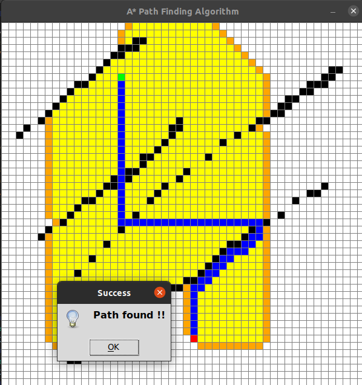

# A_star_path_finding_visualization
Visualization of the A* path finding algorithm using pygame

## Instructions
1. Clone the repositiory
2. Navigate to the directory
3. Open the terminal
4. Type 'python3 a_star.py' and press ENTER
5. Left click to select start point
6. Left click again to select end point
7. Select as many barriers as you want with left click
8. Delete unwanted selections with right click 
9. Press Space to start (You can't make more selections or remove selections once the algorithm starts)
10. A popup will appear indicating whether the path has been found or not
11. press R to reset if you want
12. Repeat the process or close

## Searhing the path

## Path found

## Path not found

